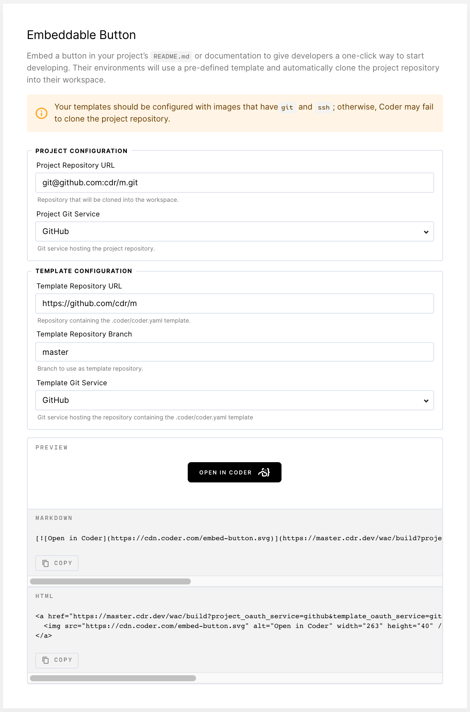

Workspaces as code (WAC) brings the _Infrastructure As Code_ paradigm to Coder
environments. WAC allows you to define and create new environments using
**workspace templates**.

[Workspace Templates](./templates.md) are declarative YAML files that describe
how to configure environments and their supporting infrastructure.

## Requirements

- You must configure a [GitHub or GitLab OAuth service](../admin/git.md)
- The image you use in your template **must** have been
  [imported](../../images/importing.md) into Coder

## Getting started

To get started, add a `.coder/coder.yaml` file to your repository.

## Open in Coder badge

To make it easy for users to use your workspace template, you can add an **Open
in Coder** badge to your repository's `README.md`.

To generate a badge for your repository, navigate to **Manage** > **Admin** >
**Templates**, and fill out the required fields. Then, the Markdown generated
can be added to your repository's `README.md`.

## Creating a workspace template

You can find a fully populated workspace template and descriptions of each field
in our [syntax guide](templates.md).
